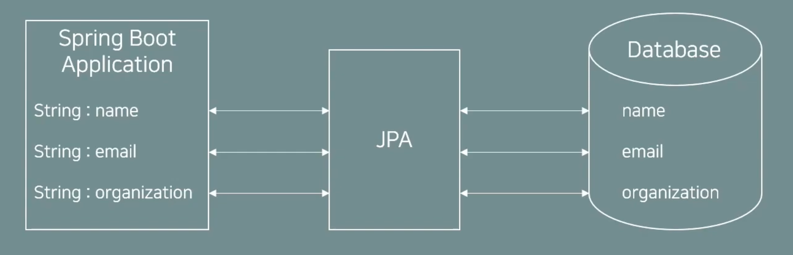
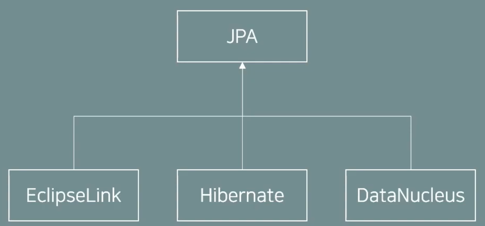
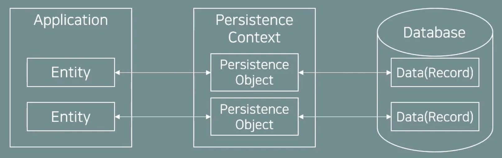

# JPA

## JPA란

- Java Persistence API의 약자
- 자바의 ORM(Object Relational Mapping) 표준 스펙을 정의
- JPA의 스펙은 자바의 객체와 데이터베이스를 어떻게 매핑하고 동작해야 하는지를 정의하고 있음



## 하이버네이트 (Hibernate)

- ORM Framework중 하나 (JPA 프로바이더 라고도 부름)
- JPA의 실제 구현체 중 하나이며, 현재 JPA 구현체 중 가장 많이 사용됨
    
    
    

## 영속성 컨텍스트 (Persistence Context)



- 영속성 컨텍스트는 JPA가 관리하는 엔티티 객체의 집합
- 엔티티 객체가 영속 컨텍스트에 들어오게 되면 JPA는 엔티티 객체의 매핑 정보를 가지고 DB에 반영함
- 엔티티 객체가 영속 컨텍스트에 들어오게 되어 관리 대상이 되면 그 객체를 영속 객체라고 부름 
(entity와 영속객체는 다른 걸로 취급)
- 영속성 컨텍스트는 세션 단위로 생명주기를 갖고 있음 (세션이 생기면서 만들어지고, 세션이 종료되면 없어짐)
- 영속성 컨텍스트에 접근하기 위해서 EntityManager를 사용함
- EntityManager는 하나의 세션으로 보고 아래와 같은 방식으로 동작을 구성
1. EntityManager 생성 (EntityManagerFactory를 통해 생성)
2. EntityManager가 가지고 있는 트랜잭션(Transaction)을 시작
3. EntityManager를 통해 영속 컨텍스트에 접근하고 객체를 작업
4. 트랜잭션을 커밋하여 DB에 반영
5. EntityManager 종료

## 엔티티(Entity) 클래스

- JPA 어노테이션을 활용하여 엔티티 클래스를 정의
- 데이터베이스의 데이터

<aside>
💡 **주요 어노테이션**
@Entity : 해당 클래스가 JPA 엔티티 클래스라고 정의
@Table : 해당 클래스가 데이터베이스의 어느 테이블에 매핑되는지 정의
@Id : DB 테이블의 Primary Key 컬럼과 매핑
@Column : 매핑할 DB의 컬럼 이름과 필드 변수의 이름이 다를 경우 매핑하기 위해 사용

</aside>

# CODE

## build.gradle

```
dependencies {
    implementation 'org.hibernate:hibernate-core:5.6.1.Final'
    implementation 'mysql:mysql-connector-java:8.0.28'
}
```

## persistence.xml 설정

경로 : ~/META-INF/persistence.xml

```xml
<?xml version="1.0" encoding="UTF-8"?>
<persistence version="2.2"
             xmlns="http://xmlns.jcp.org/xml/ns/persistence" xmlns:xsi="http://www.w3.org/2001/XMLSchema-instance"
             xsi:schemaLocation="http://xmlns.jcp.org/xml/ns/persistence http://xmlns.jcp.org/xml/ns/persistence/persistence_2_2.xsd">
    <!--  EntityManagerFactory 생성 시 사용되는 persistence name -->
    <persistence-unit name="persistence">
        <properties>

						<!-- Entity Class 경로 -->
						<class>jpastudy.entity.UserEntity</class>
            <!-- 필수 속성 -->
            <property name="javax.persistence.jdbc.driver" value="com.mysql.cj.jdbc.Driver"/>
            <property name="javax.persistence.jdbc.user" value="db유저네임명"/>
            <property name="javax.persistence.jdbc.password" value="db비밀번호"/>
            <property name="javax.persistence.jdbc.url" value="jdbc:mysql://localhost:3306/스키마명?characterEncoding=UTF-8&amp;serverTimezone=UTC"/>

            <!-- 하이버네이트 사용 시 다른 DB에서 MySQL 문법을 사용 가능하도록 변경.-->
            <property name="hibernate.dialect" value="org.hibernate.dialect.MySQL8Dialect"/>
            <!-- 콘솔에 SQL 출력 여부 -->
            <property name="hibernate.show_sql" value="true"/>
            <!-- 가독성 높여주는 formatting 여부 -->
            <property name="hibernate.format_sql" value="true"/>
            <!-- Comment 확인 여부 -->
            <property name="hibernate.use_sql_comments" value="true"/>

        </properties>
    </persistence-unit>
</persistence>
```

## UserEntity.java

```java
import javax.persistence.Column;
import javax.persistence.Entity;
import javax.persistence.Id;
import javax.persistence.Table;
import java.time.LocalDateTime;

@Entity
@Table(name="user")
public class UserEntity {

    @Id // primary key
    private String email;

    private String name;

    @Column(name = "created_at")
    private LocalDateTime createdAt;

    @Column(name = "updated_at")
    private LocalDateTime updatedAt;

    public String getEmail() {
        return email;
    }

    public String getName() {
        return name;
    }

    public LocalDateTime getCreatedAt() {
        return createdAt;
    }

    public LocalDateTime getUpdatedAt() {
        return updatedAt;
    }

    // JPA가 Proxy 구조로 객체를 관리하기 위해 필요한 Default Constructor
    public UserEntity() {

    }

    public UserEntity(String email, String name, LocalDateTime createdAt, LocalDateTime updatedAt) {
        this.email = email;
        this.name = name;
        this.createdAt = createdAt;
        this.updatedAt = updatedAt;
    }

}
```

## BasicJpaApplication.java

```java
import jpastudy.entity.UserEntity;

import javax.persistence.EntityManager;
import javax.persistence.EntityManagerFactory;
import javax.persistence.EntityTransaction;
import javax.persistence.Persistence;
import java.time.LocalDateTime;

public class BasicJpaApplication {

    public static void main(String[] args) {

        // EntityManagerFactory는 EntityManager를 생성하기 위한 팩토리 인터페이스로 persistence 단위별로 팩토리를 생성
        EntityManagerFactory entityManagerFactory = Persistence.createEntityManagerFactory(
                "basicjpa"); // persistence.xml 파일에 기입한 <persistence-unit> 이름을 적어줘야 한다.

        // EntityManager 객체 생성
        // EntityManager는 PersistenceContext와 Entity를 관리
        // 하나의 connection이라고 보면 됨
        EntityManager entityManager = entityManagerFactory.createEntityManager();

        // EntityManager에서 트랜잭션을 가져와 관리하기 위한 객체 생성
        EntityTransaction entityTransaction = entityManager.getTransaction();

        try{
            // 트랜잭션을 시작해야 DB를 조작할 수 있음
            entityTransaction.begin();

            // 저장하고자 하는 엔티티 객체를 생성
            UserEntity userEntity = new UserEntity("test@gmail.com", "test1", LocalDateTime.now(), LocalDateTime.now());

            // UserEntity 객체를 Persistence Context에 추가
            entityManager.persist(userEntity);

            // 실제 DB에 반영 (쿼리문 실행)
            entityTransaction.commit();

        } catch (Exception e) {
            e.printStackTrace();

            // 예외가 발생 했을 경우 트랜잭션 롤백 진행
            entityTransaction.rollback();
        } finally {
            // 엔티티 매니저 종료. JDBC에서 Connection 종료하는 것과 동일한 기능으로 보면 됨.
            entityManager.close();
        }
        // 팩토리 종료. 커넥션 풀 자원을 반환
        entityManagerFactory.close();
    }
}
```

## MySql Table DDL

```sql
CREATE TABLE `USER` (
  `EMAIL` varchar(100) NOT NULL PRIMARY KEY,
  `NAME` varchar(100) NOT NULL,
  `CREATED_AT` date DEFAULT NULL,
  `UPDATED_AT` date DEFAULT NULL
) ENGINE=InnoDB DEFAULT CHARSET=utf8mb4 COLLATE=utf8mb4_0900_ai_ci;
```